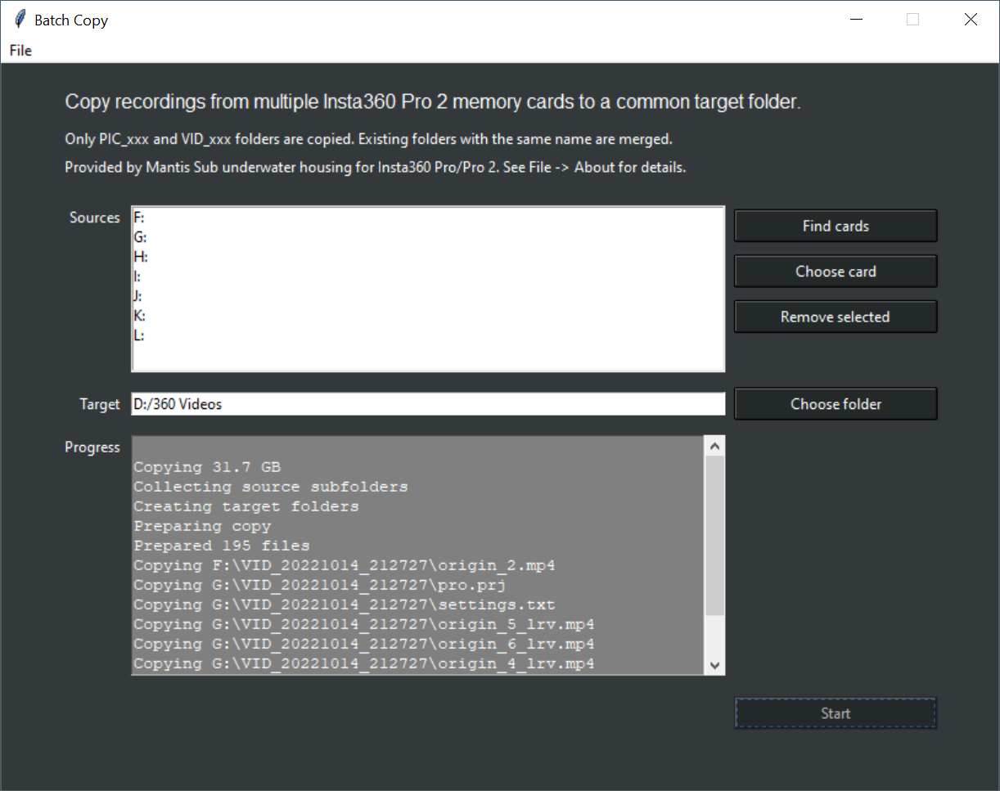

# Batch Copy for Insta360 Pro 2

## Introduction

Batch Copy can copy files from multiple Insta360 Pro 2 memory cards to a common destination directory. It is written in Python.

## Installation

### From binaries

The releases section contains binary distributions for Windows and macOS that were packaged with pyinstaller. Install these as follows

#### Windows 

- Double-click on the installer .exe
- You may be presented with a Security Warning. 
  - Click on “More Info” -> click “Run anyway”.

#### macOS

- Both Intel and Apple CPUs are supported (Apple via Rosetta 2) for macOS Big Sur (11.0) and higher.
- Open the .dmg file and drag batchcopy.app and ffprobe to your /Applications folder.
- When starting the app you may be presented with a Security Warning. 
  - Click OK, then go to System Preferences -> Security & Privacy -> click “Open Anyway”.
- If you double-click on the app and nothing happens you likely have macOS 10.15 or lower, which is not supported.


### From source

Install your favourite version of Python 3 (3.8 or higher). See https://www.python.org/downloads/ 

If you're on macOS and install Python via homebrew, you might have to separately install python-tk:

```
brew install python@3.11
brew install python-tk@3.11
```

Download or clone the repository, then start batchcopy.py from the command line.
```
python3 batchcopy.py
```


## Usage

Start batchcopy.py from the command line.

```
python3 batchcopy.py
```



At a minimum you must enter the following settings:

- Sources: One or more memory cards. Click "Find cards" to automatically list all connected Pro 2 cards.
- Target: The folder where the program should save the recordings.

Then click **Start** to start the copying process.

Only PIC_xxx and VID_xxx folders are copied. Existing folders with the same name are merged. 

The program spawns one copy process per card to copy in parallel. Closing the program at any time will stop all running copy processes.


## Problem resolution

- The progress window should provide enough information if something goes wrong.
- Slow copy: disable virus checker for the source and destination folders during copy.
- If you double-click on the app and nothing happens you likely have macOS 10.15 or lower, which is not supported.
